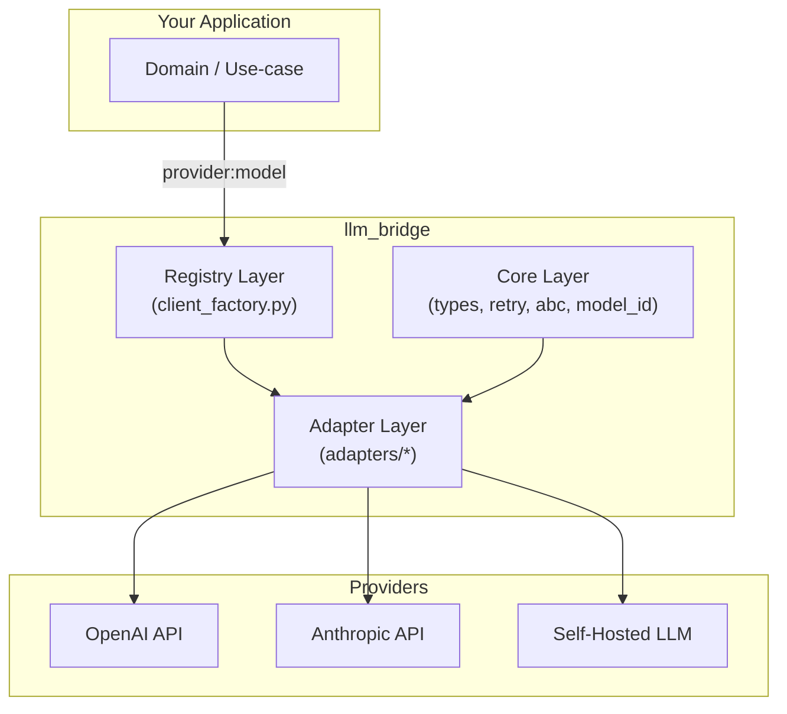

※ 全然まだ未完成

# llm_bridge

> **プロバイダ非依存のシンプル & 拡張可能な LLM クライアントラッパー**

※ README.md written by o3

---

## 📖 概要

`llm_bridge` は **「`provider:model` 形式」** で指定された任意の LLM を、まったく同じインターフェースで呼び出すことを目的とした軽量ライブラリです。

- **プロバイダ非依存 API** … `generate()` さえ知っていれば良い
- **リトライ標準装備** … Exponential Back‑off + Jitter, 例外階層も統一
- **追加コストゼロの拡張性** … Adapter を 1 クラス書いて `provider_registry.register()` するだけ

> Deepwiki 風に言えば「**結節点 (Bridge) を中心に据えたレイヤード・アーキテクチャ**」。外側(アプリ)と内側(SDK)の結合度を最小化し、保守性を最大化する設計を採っています。

---

## 🏗️ アーキテクチャ



- **Core Layer**: 型定義・例外・リトライなど *依存ゼロ* の純粋ロジック。
- **Adapter Layer**: 各社 SDK との橋渡し。`AbstractLLMClient` を実装。
- **Registry Layer**: `provider` スラッグと Adapter クラスをマッピング。
- **Your Application**: `from llm_bridge.registry import LLMClientFactory` で初期化し、`generate()` を叩くだけ。

### データフロー (Deep‑Dive)
1. `LLMClientFactory.initialize_client("openai:gpt-4o")` を呼び出す
2. `ModelId.parse()` が `provider=model` を正規化
3. `provider_registry.get_adapter_cls()` が適切な Adapter を解決
4. Adapter (`OpenAIAdapter`) が **Core Layer** のリトライを継承しつつ SDK を呼び出す
5. 失敗すればリトライ、成功すればプレーンなテキストが返る

---

## 📂 ディレクトリ構造

```
src/llm_bridge
├── adapters          # 各社向け Adapter 実装
├── core              # SDK 無依存のドメインロジック
├── registry          # Adapter 登録 & 生成
└── __init__.py       # ライブラリ公開ポイント
```

ファイル | 役割 | 主なクラス
--- | --- | ---
`core/abc.py` | Adapter が実装すべき抽象基底 | `AbstractLLMClient`
`core/retry.py` | Exponential Back‑off | `RetryStrategy`, `with_retry`
`core/types.py` | DTO & Enum 定義 | `Message`, `GenerationParams`, `Role`
`adapters/openai_adapter.py` | OpenAI 専用ラッパー | `OpenAIAdapter`
`registry/provider_registry.py` | Provider ↔ Adapter 登録表 | `ProviderRegistry`
`registry/client_factory.py` | Adapter 生成ファクトリ | `LLMClientFactory`

---

## 🚀 インストール

```bash
pip install llm_bridge  # まだ PyPI に公開していない場合はローカルパスを指定
```

> **必須環境変数**: `OPENAI_API_KEY` (OpenAI Adapter 利用時)

---

## ⚡ クイックスタート

```python
from llm_bridge.registry.client_factory import LLMClientFactory
from llm_bridge.core.types import Message, GenerationParams, Role

# 1. クライアント初期化 (provider:model)
client = LLMClientFactory.initialize_client("openai:gpt-4o")

# 2. 会話履歴を組み立て
messages = [
    Message(role=Role.system,    content="You are a helpful assistant."),
    Message(role=Role.user,      content="日本一高い山は？"),
]

# 3. 生成パラメータ (必要に応じて)
params = GenerationParams(temperature=0.3)

# 4. 推論実行
answer = client.generate(messages, params)
print(answer)
```

---

## 🔌 プロバイダ追加方法

1. SDK をインポートした `MyNewAdapter(AbstractLLMClient)` を作成
2. `provider_registry.register("myprovider", MyNewAdapter)` を呼び出す
3. テストを書く (`tests/adapters/test_myprovider.py`)

これだけで `LLMClientFactory.initialize_client("myprovider:my‑model")` が機能します。

---

## 🧪 テスト

```bash
pytest -q
```

単体テストは **core** と **registry**、結合テストは **adapters** を対象に配置しています。

---

## 📜 ライセンス

MIT License.

---

## 🙌 Contributing

Issue / Pull Request 大歓迎です。Adapter 追加時は以下を遵守してください。

- **SDK 例外 → `LLMBridgeError`** へ必ず変換する
- 外部依存は Adapter 内に閉じ込め、`core` への逆依存を避ける
- `pytest --cov` が 95% 以上通ること

---

## ✨ FAQ

| 質問 | 回答 |
| --- | --- |
| 非同期対応は？ | 現在 Sync のみ。同一 API で Async パスを追加予定です |
| OpenAI 0.x 系を使いたい | `_invoke()` を書き換えれば動きます |
| モデル毎の Tokenizer は？ | スコープ外。上位層でご対応ください |

---

> Made with ❤️  by [llm_bridge contributors]

